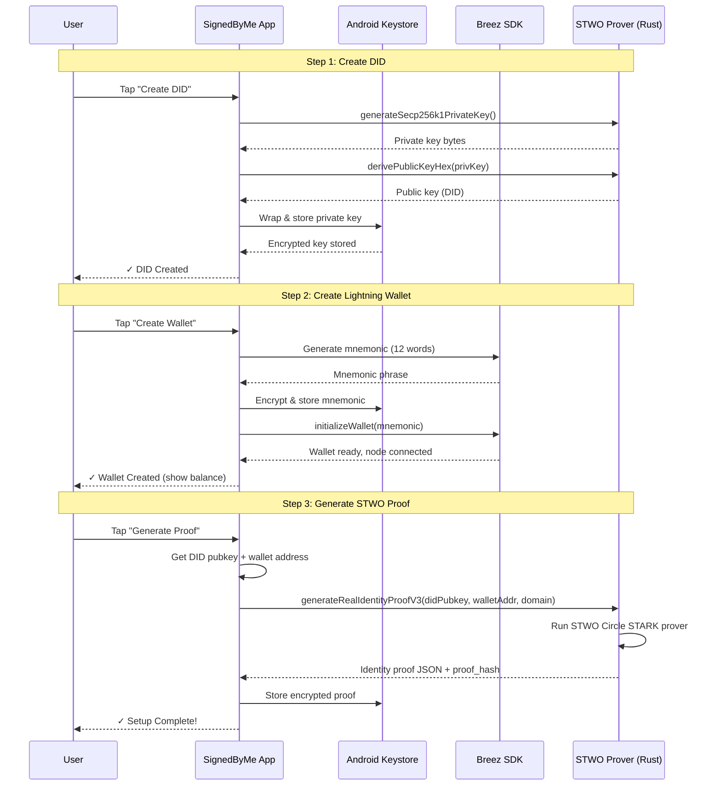
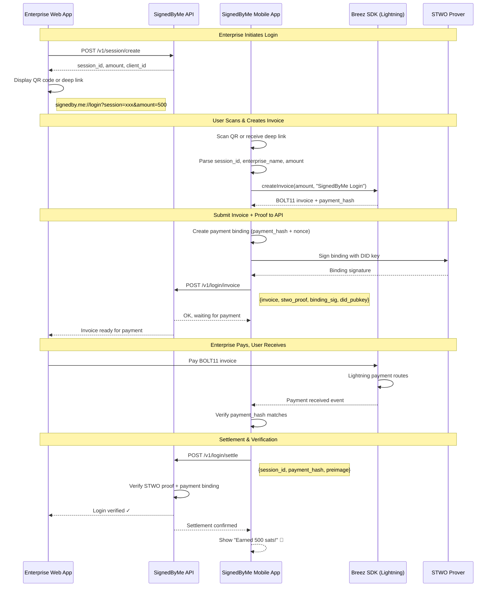
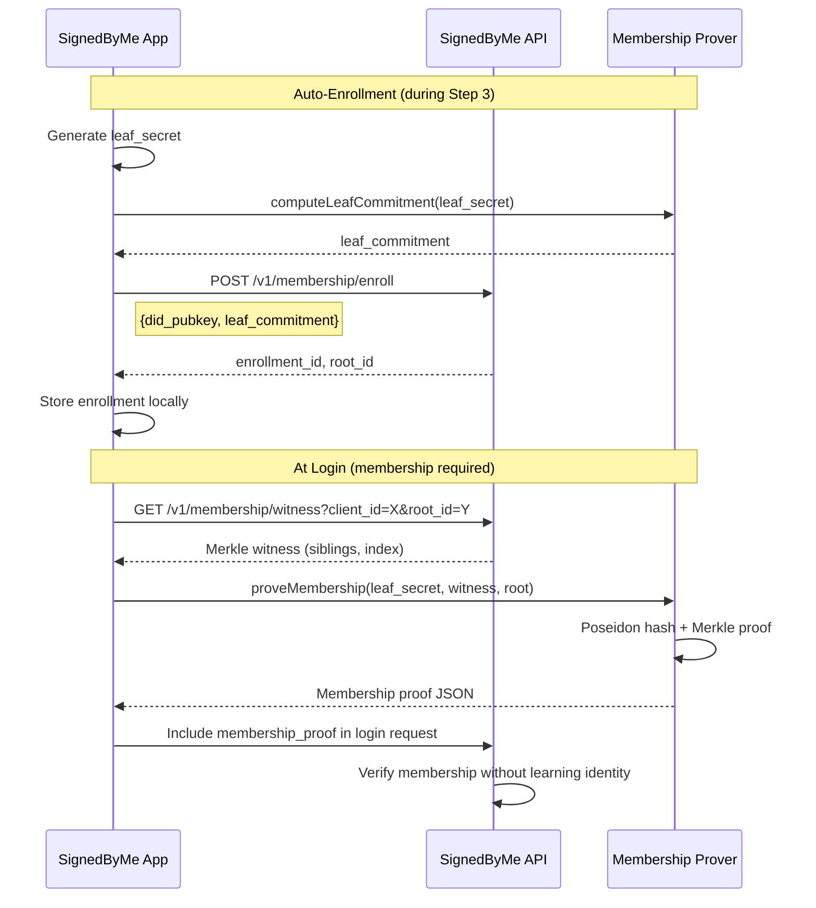

# SignedByMe

**Get Paid to Log In** — Bitcoin-based identity verification where users earn sats for authentication.

## How It Works

1. User sets up DID + Lightning wallet in the app (one-time onboarding)
2. User generates STWO proof binding their DID ↔ Wallet
3. Enterprise shows "Sign in with SignedByMe" QR or deep link
4. User scans → app creates Lightning invoice
5. Enterprise pays invoice → sats go to user's wallet
6. STWO proof + payment binding sent to API → User verified AND got paid

## Architecture

```
┌─────────────────┐     ┌─────────────────┐     ┌─────────────────┐
│  Enterprise     │     │  SignedByMe     │     │  User's         │
│  Web App        │────▶│  API            │◀────│  Mobile App     │
└─────────────────┘     └─────────────────┘     └─────────────────┘
                                                        │
                                                        ▼
                                                ┌─────────────────┐
                                                │  Lightning      │
                                                │  Network        │
                                                └─────────────────┘
```

---

## Flow Diagrams

### Onboarding Flow (One-Time Setup)



### Login Flow (Get Paid to Verify)



### Membership Proof Flow (Mandatory)

> **Note:** Membership verification is **mandatory by default**. Users must prove they're in an enterprise's pre-approved allowlist to log in. This prevents Sybil attacks and ensures only authorized identities can authenticate.



**Privacy guarantee:** The API verifies "this user is in your allowlist" without learning *which* user. Zero-knowledge membership proof.

---

## Cryptographic Chain

```
DID Private Key ──sign──▶ Identity Proof (STWO)
        │                         │
        │                         ▼
        │                   proof_hash
        │                         │
        ▼                         ▼
Payment Binding ◀────────── binding_hash
        │
        ├── payment_hash (from invoice)
        ├── nonce (from API)
        └── signature (DID signs binding)

At verification:
✓ STWO proof is valid (DID owns wallet)
✓ Binding signature matches DID
✓ Payment hash matches paid invoice
✓ Nonce prevents replay
✓ Membership proof valid (user in allowlist)
```

---

## Project Structure

```
signedby/
├── app/                          # Android app + API (mixed)
│   ├── src/main/java/.../        # Android Kotlin code
│   │   ├── MainActivity.kt       # Main UI
│   │   ├── DidWalletManager.kt   # DID + proof management
│   │   ├── BreezWalletManager.kt # Lightning wallet
│   │   └── NativeBridge.kt       # Rust JNI bindings
│   ├── main.py                   # FastAPI entry point
│   ├── routes/                   # API endpoints
│   │   ├── login_invoice.py      # Login flow
│   │   ├── membership.py         # Membership enrollment/proofs
│   │   ├── session.py            # Session management
│   │   └── roots.py              # Merkle root registry
│   └── lib/                      # API utilities
│       ├── crypto.py             # Signature verification
│       └── stwo_verify.py        # STWO proof verification
├── native/btcdid_core/           # Rust library
│   └── src/
│       ├── lib.rs                # JNI exports
│       ├── stwo_*.rs             # STWO prover
│       └── membership.rs         # Merkle proofs
├── site/                         # Demo website
├── DID_BTC/                      # iOS app (Swift)
└── docs/
```

---

## URLs

- **Deep Link:** `signedby.me://login?session=xxx&amount=500`
- **API Base:** `https://api.beta.privacy-lion.com`
- **Demo Site:** `https://beta.privacy-lion.com`

---

## Tech Stack

| Component | Technology |
|-----------|------------|
| Mobile App | Kotlin + Jetpack Compose |
| Lightning | Breez SDK |
| ZK Proofs | STWO (Circle STARKs) |
| Native Crypto | Rust + secp256k1 |
| API | FastAPI (Python) |
| Membership | Poseidon hash + Merkle trees |

---

## Status

- ✅ Android app complete
- ✅ Real STWO proofs (~1ms on device)
- ✅ Merkle membership proofs (mandatory by default)
- ✅ Real signature verification (secp256k1)
- ✅ STWO verifier deployed (full STARK verification)
- ✅ API deployed with rate limiting
- ⏳ iOS version (planned)

---

## License

SignedByMe is **source-available** under the **SignedByMe Source-Available License v1.0 (SSAL-1.0)**.

- Until **February 17, 2030**: You may use, modify, test, fork, and contribute to the code freely for personal projects, internal tools, research, evaluation, and integration into unrelated products. **You may not** distribute or operate this code (or derivatives) as part of a **Competing Application** (services offering similar key-based auth flows, paid/gated authorization, or OIDC-style token issuance — full definition in [`LICENSE`](./LICENSE)).

- From **February 18, 2030**: All restrictions automatically end; the codebase becomes available under **Apache License 2.0**.

If you're unsure whether your use case is permitted, please reach out before shipping anything.

Full license: [`LICENSE`](./LICENSE)  
Apache 2.0 text (future): [`LICENSE-APACHE`](./LICENSE-APACHE)  
Trademarks: [`TRADEMARK.md`](./TRADEMARK.md)
