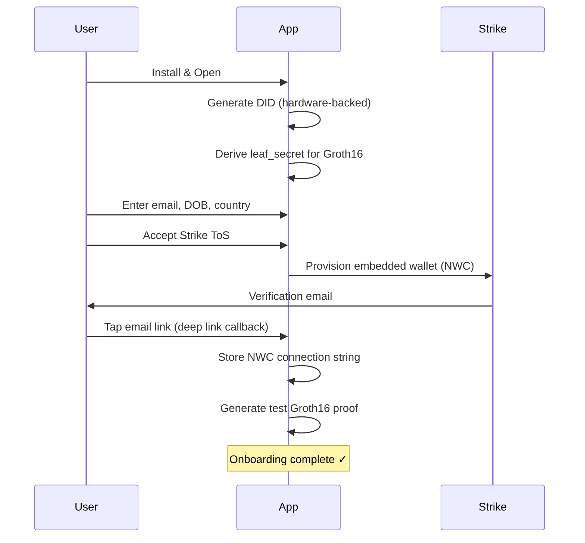
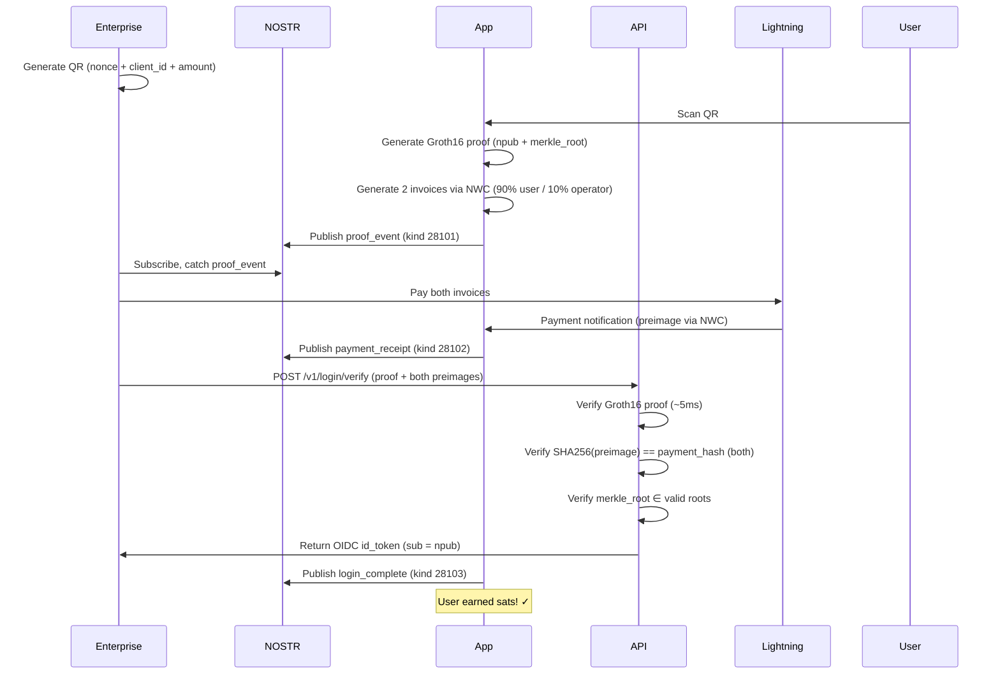
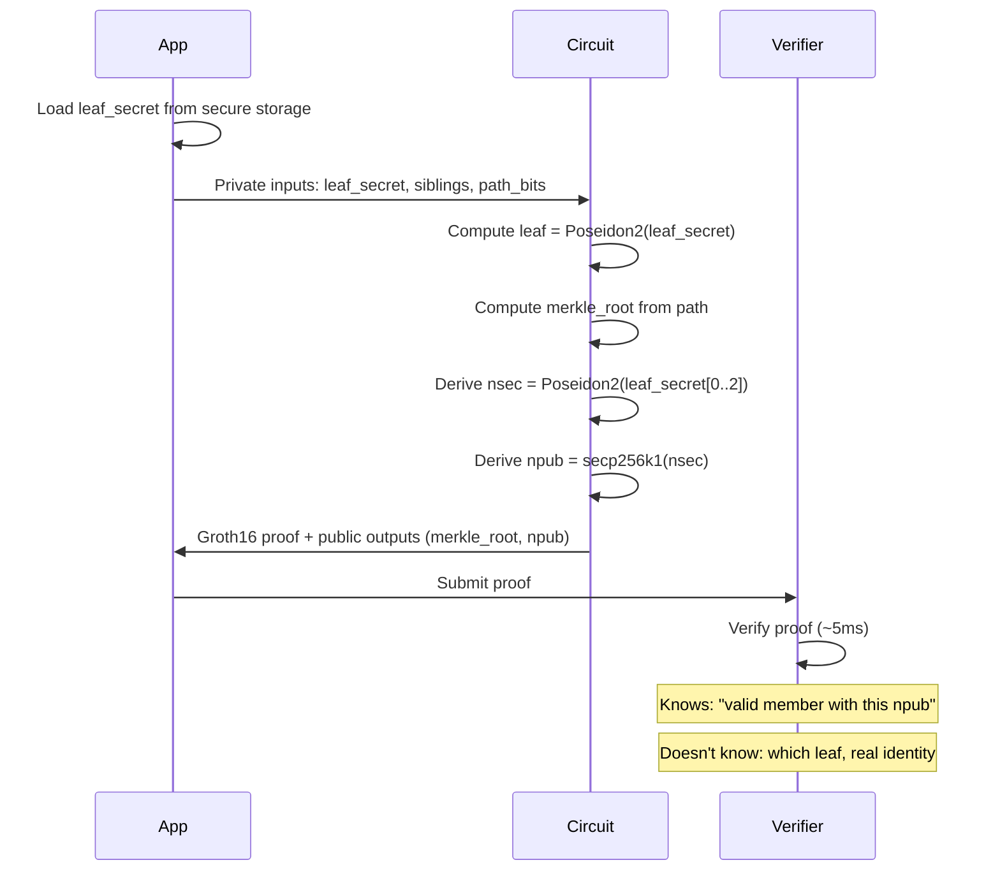

# SignedByMe

**Get Paid to Log In** — Bitcoin-based identity verification where users earn sats for authentication.

## How It Works

1. User sets up DID + Lightning wallet in the app (one-time onboarding)
2. User generates Groth16 ZK proof proving membership in enterprise's allowlist
3. Enterprise shows "Sign in with SignedByMe" QR or deep link
4. User scans → app generates proof + creates Lightning invoices (90% user / 10% operator)
5. App publishes proof to NOSTR → Enterprise catches it, pays both invoices
6. Enterprise submits proof + payment preimages to API → gets OIDC id_token
7. **User verified AND got paid**

## Architecture

```
┌─────────────────┐      ┌─────────────────┐      ┌─────────────────┐
│   Enterprise    │      │   SignedByMe    │      │    User's       │
│    Web App      │─────▶│      API        │◀─────│   Mobile App    │
└─────────────────┘      └─────────────────┘      └─────────────────┘
        │                        │                        │
        │                        │                        ▼
        │                        │               ┌─────────────────┐
        │                        │               │  NOSTR Relays   │
        │                        │               │  (Audit Trail)  │
        │                        │               └─────────────────┘
        │                        │                        │
        ▼                        │                        │
┌─────────────────┐              │                        │
│    Lightning    │◀─────────────┴────────────────────────┘
│    Network      │
└─────────────────┘
```

**Key architectural decisions:**
- Server is a pure REST API — **zero NOSTR involvement**
- Phone publishes all NOSTR events (audit trail)
- Enterprise watches NOSTR for proof, pays invoices, forwards to server
- Stateless login: one API call (`POST /v1/login/verify`) returns OIDC id_token

## Flow Diagrams

### Onboarding Flow (One-Time Setup)



### Login Flow (Get Paid to Verify)



### Membership Proof Flow (Zero-Knowledge)



> **Note:** Membership verification is mandatory. Users must prove they're in an enterprise's pre-approved allowlist to log in. This prevents Sybil attacks and ensures only authorized identities can authenticate. **Privacy guarantee:** The API verifies "this user is in your allowlist" without learning *which* user. Zero-knowledge membership proof.

## Cryptographic Chain

```
leaf_secret (32 bytes, hardware-backed)
    │
    ├──▶ leaf_commitment = Poseidon2(leaf_secret[0..5])
    │         │
    │         ▼
    │    Merkle Tree (depth 20, ~1M leaves)
    │         │
    │         ▼
    │    merkle_root (public output)
    │
    └──▶ nsec = Poseidon2(leaf_secret[0..2])
              │
              ▼
         npub = secp256k1_derive(nsec)
              │
              ▼
         NOSTR identity (signs all audit events)
              │
              ▼
         OIDC id_token.sub (user's pseudonymous identity)
```

**At verification:**
- ✓ Groth16 proof is valid (user is in Merkle tree)
- ✓ npub is cryptographically bound to membership
- ✓ Payment hashes match paid invoices (both preimages verified)
- ✓ merkle_root ∈ last 30 valid roots
- ✓ NOSTR events signed by proven npub (tamper-evident audit trail)

## Project Structure

```
signedby/
├── app/                          # Android app + API (mixed repo)
│   ├── src/main/java/.../        # Android Kotlin code
│   │   ├── MainActivity.kt       # Main UI + onboarding
│   │   ├── DidWalletManager.kt   # DID + Groth16 proof management
│   │   ├── NwcWalletManager.kt   # NWC wallet (Strike-backed)
│   │   ├── NostrManager.kt       # NOSTR client + NWC integration
│   │   ├── DlcManager.kt         # DLC settlement (preimage-based)
│   │   └── NativeBridge.kt       # Rust JNI bindings
│   ├── main.py                   # FastAPI entry point
│   ├── routes/                   # API endpoints
│   │   ├── groth16_login.py      # POST /v1/login/verify (stateless)
│   │   ├── membership.py         # Enrollment API (Phase 10)
│   │   ├── roots.py              # Merkle root registry
│   │   └── oidc_*.py             # OIDC discovery + JWKS
│   └── db/                       # SQLite database
├── native/signedby_core/         # Rust library
│   └── src/
│       ├── lib.rs                # JNI exports
│       ├── groth16/              # Groth16 prover (rapidsnark FFI)
│       ├── nostr/                # NOSTR client (nostr-sdk)
│       └── membership/           # Merkle proofs + Poseidon2
├── circuits/                     # Circom circuit
│   ├── membership.circom         # Main circuit (101K constraints)
│   └── build/                    # Compiled circuit + keys
│       ├── membership_final.zkey # Proving key (85MB)
│       └── verification_key.json # Verifier key
├── server/groth16-verifier/      # Rust server-side verifier
├── infra/                        # Deployment configs
│   └── Caddyfile                 # Reverse proxy config
├── acme-site/                    # Demo enterprise site
├── site/admin/                   # Admin dashboard
└── ios/                          # iOS app (Swift) - in progress
```

## URLs

| Purpose | URL |
|---------|-----|
| Deep Link | `signedby://login?session=xxx&amount=500` |
| API Base | `https://api.beta.privacy-lion.com` |
| Demo Site | `https://acme.beta.privacy-lion.com` |
| NOSTR Relay | `wss://relay.privacy-lion.com` |
| OIDC Discovery | `https://api.beta.privacy-lion.com/.well-known/openid-configuration` |

## Tech Stack

| Component | Technology |
|-----------|------------|
| Mobile App | Kotlin + Jetpack Compose |
| Lightning Wallet | NWC (NIP-47) + Lightning |
| ZK Proofs | Groth16 (circom + rapidsnark) |
| Native Crypto | Rust + secp256k1 + ark-groth16 |
| Audit Trail | NOSTR (kinds 28101-28103) |
| API | FastAPI (Python) + SQLite |
| Membership | Poseidon2 hash + Incremental Merkle tree |
| OIDC | RS256 signed id_tokens |

## Status

- ✅ Android app complete (onboarding + login flow)
- ✅ Groth16 proofs working (2.5s on Pixel 8)
- ✅ Merkle membership proofs (depth 20, ~1M leaves)
- ✅ NOSTR audit trail (strfry relay deployed)
- ✅ NWC wallet integration (Lightning/NWC)
- ✅ Server-side Groth16 verifier (~5ms)
- ✅ OIDC endpoints (discovery + JWKS)
- ✅ Stateless login API (`POST /v1/login/verify`)
- ⏳ Phase 10: B2C Enrollment API (next)
- ⏳ iOS version (after Android stable)

## License

SignedByMe is **source-available** under the **SignedByMe Source-Available License v1.0 (SSAL-1.0)**.

- Until **February 17, 2030**: You may use, modify, test, fork, and contribute to the code freely for personal projects, internal tools, research, evaluation, and integration into unrelated products. **You may not** distribute or operate this code (or derivatives) as part of a **Competing Application** (services offering similar key-based auth flows, paid/gated authorization, or OIDC-style token issuance — full definition in [`LICENSE`](./LICENSE)).

- From **February 18, 2030**: All restrictions automatically end; the codebase becomes available under **Apache License 2.0**.

If you're unsure whether your use case is permitted, please reach out before shipping anything.

Full license: [`LICENSE`](./LICENSE)  
Apache 2.0 text (future): [`LICENSE-APACHE`](./LICENSE-APACHE)  
Trademarks: [`TRADEMARK.md`](./TRADEMARK.md)
